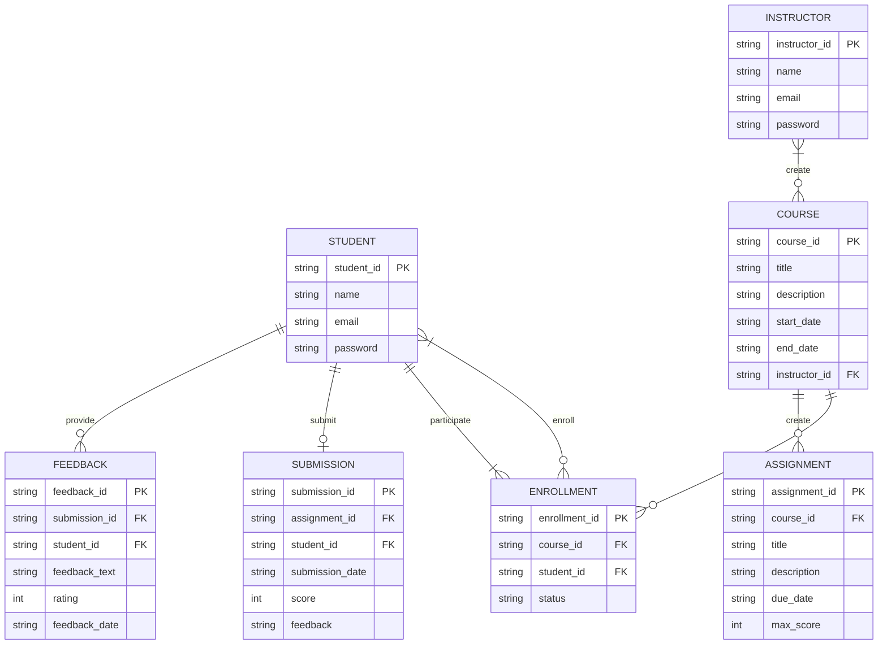

```mermaid
erDiagram
	STUDENT }|--o{ ENROLLMENT : enroll
	STUDENT {
	string student_id PK
	string name
	string email
	string password
	}
	INSTRUCTOR }|--o{ COURSE: create
	INSTRUCTOR {
	string instructor_id PK
	string name
	string email
	string password
	}
	COURSE{
	string course_id PK
	string title
	string description
	string start_date
	string end_date
	string instructor_id FK
	}
	COURSE ||--o{ ENROLLMENT : manage
	COURSE ||--o{ ASSIGNMENT : create
	ASSIGNMENT {
	string assignment_id PK
	string course_id FK
	string title
	string description
	string due_date
	int max_score
	}
	STUDENT ||--|{ ENROLLMENT : participate
	STUDENT ||--o| SUBMISSION : submit
	STUDENT ||--o{ FEEDBACK : provide
	ENROLLMENT {
	string enrollment_id PK
	string course_id FK
	string student_id FK
	string status
	}
	SUBMISSION {
	string submission_id PK
	string assignment_id FK
	string student_id FK
	string submission_date
	int score
	string feedback
	}
	FEEDBACK {
	string feedback_id PK
	string submission_id FK
	string student_id FK
	string feedback_text
	int rating
	string feedback_date
	}
```
