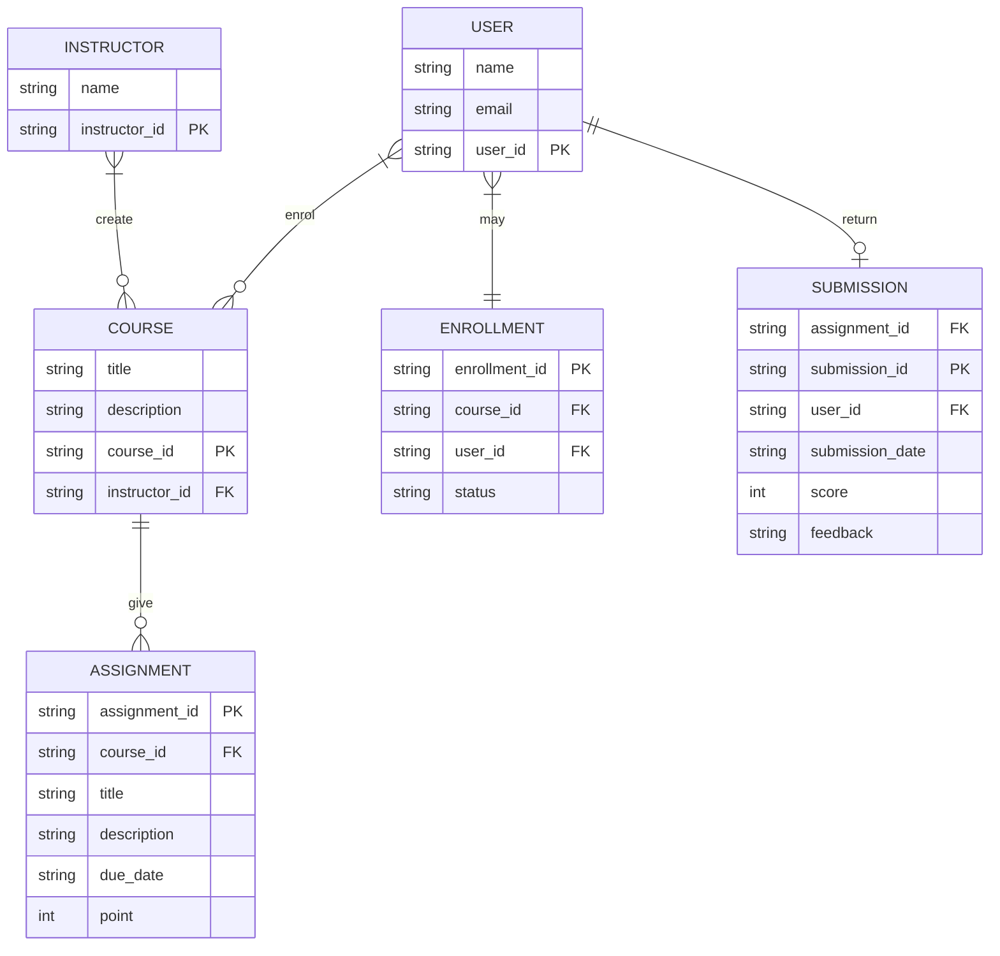

```mermaid
erDiagram
	USER }|--o{ COURSE : enrol
	USER {
	string name
	string email
	string user_id PK
	}
	INSTRUCTOR }|--o{ COURSE: create
	INSTRUCTOR {
	string name
	string instructor_id PK
	}
	COURSE{
	string title
	string description
	string course_id PK
	string instructor_id FK
	}
	COURSE ||--o{ ASSIGNMENT : give
	ASSIGNMENT {
	string assignment_id PK
	string course_id FK
	string title
	string description
	string due_date
	int point
	}
	USER }|--|| ENROLLMENT : may
	ENROLLMENT {
	string enrollment_id PK
	string course_id FK
	string user_id FK
	string status
	}
	USER ||--o| SUBMISSION : return
	SUBMISSION {
	string assignment_id FK
	string submission_id PK
	string user_id FK
	string submission_date
	int score
	string feedback
	}
```
