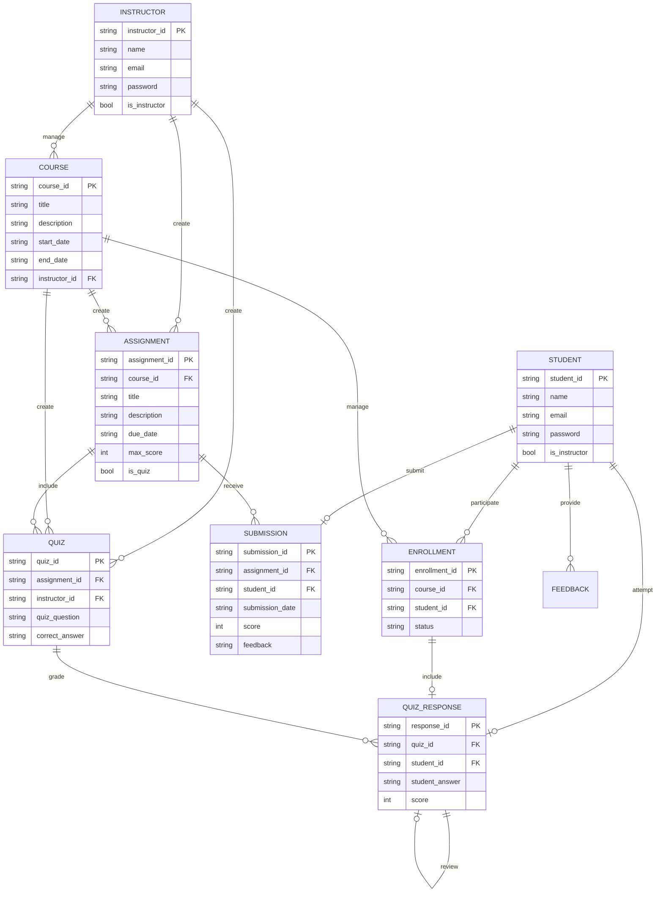

```mermaid
erDiagram
	STUDENT {
	string student_id PK
	string name
	string email
	string password
	bool is_instructor
	}
	INSTRUCTOR {
	string instructor_id PK
	string name
	string email
	string password
	bool is_instructor
	}
	COURSE {
	string course_id PK
	string title
	string description
	string start_date
	string end_date
	string instructor_id FK
	}
	ENROLLMENT {
	string enrollment_id PK
	string course_id FK
	string student_id FK
	string status
	}
	ASSIGNMENT {
	string assignment_id PK
	string course_id FK
	string title
	string description
	string due_date
	int max_score
	bool is_quiz
	}
	SUBMISSION {
	string submission_id PK
	string assignment_id FK
	string student_id FK
	string submission_date
	int score
	string feedback
	}
	QUIZ {
	string quiz_id PK
	string assignment_id FK
	string instructor_id FK
	string quiz_question
	string correct_answer
	}
	QUIZ_RESPONSE {
	string response_id PK
	string quiz_id FK
	string student_id FK
	string student_answer
	int score
	}
	STUDENT ||--o{ ENROLLMENT : participate
	STUDENT ||--o| SUBMISSION : submit
	STUDENT ||--o{ FEEDBACK : provide
	STUDENT ||--o| QUIZ_RESPONSE : attempt
	INSTRUCTOR ||--o{ COURSE : manage
	INSTRUCTOR ||--o{ ASSIGNMENT : create
	INSTRUCTOR ||--o{ QUIZ : create
	ENROLLMENT ||--o| QUIZ_RESPONSE : include
	COURSE ||--o{ ENROLLMENT : manage
	COURSE ||--o{ ASSIGNMENT : create
	COURSE ||--o{ QUIZ : create
	ASSIGNMENT ||--o{ SUBMISSION : receive
	ASSIGNMENT ||--o{ QUIZ : include
	QUIZ ||--o{ QUIZ_RESPONSE : grade
	QUIZ_RESPONSE ||--o| QUIZ_RESPONSE : review
```
