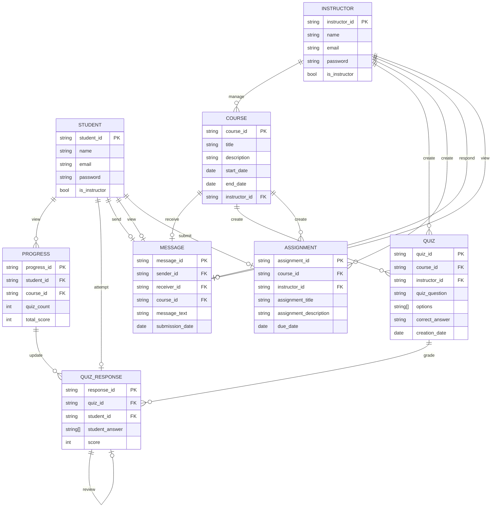

```mermaid
erDiagram
	STUDENT {
		string student_id PK
		string name
		string email
		string password
		bool is_instructor
	}
	INSTRUCTOR {
		string instructor_id PK
		string name
		string email
		string password
		bool is_instructor
	}
	COURSE {
		string course_id PK
		string title
		string description
		date start_date
		date end_date
		string instructor_id FK
	}
	QUIZ {
		string quiz_id PK
		string course_id FK
		string instructor_id FK
		string quiz_question
		string[] options
		string correct_answer
		date creation_date
	}
	ASSIGNMENT {
		string assignment_id PK
		string course_id FK
		string instructor_id FK
		string assignment_title
		string assignment_description
		date due_date
	}
	QUIZ_RESPONSE {
		string response_id PK
		string quiz_id FK
		string student_id FK
		string[] student_answer
		int score
	}
	PROGRESS {
		string progress_id PK
		string student_id FK
		string course_id FK
		int quiz_count
		int total_score
	}
	MESSAGE {
		string message_id PK
		string sender_id FK
		string receiver_id FK
		string course_id FK
		string message_text
		date submission_date
	}
	STUDENT ||--o{ PROGRESS : view
	STUDENT ||--o| QUIZ_RESPONSE : attempt
	STUDENT ||--o| MESSAGE : send
	STUDENT ||--o| MESSAGE : view
	STUDENT ||--o| ASSIGNMENT : submit
	INSTRUCTOR ||--o{ COURSE : manage
	INSTRUCTOR ||--o{ QUIZ : create
	INSTRUCTOR ||--o{ ASSIGNMENT : create
	INSTRUCTOR ||--o| MESSAGE : respond
	INSTRUCTOR ||--o| MESSAGE : view
	COURSE ||--o| MESSAGE : receive
	COURSE ||--o{ QUIZ : create
	COURSE ||--o{ ASSIGNMENT : create
	QUIZ ||--o{ QUIZ_RESPONSE : grade
	QUIZ_RESPONSE ||--o| QUIZ_RESPONSE : review
	PROGRESS ||--o{ QUIZ_RESPONSE : update
```
