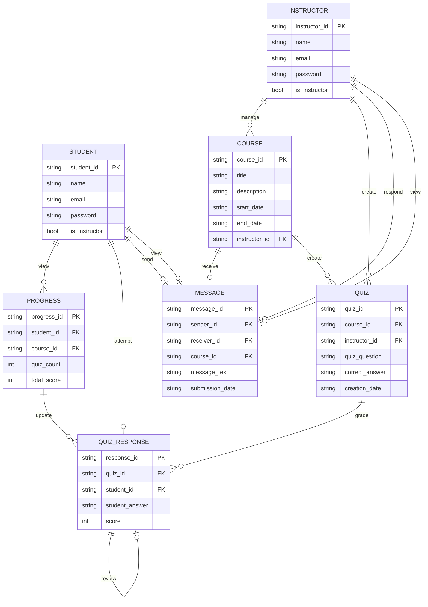

```mermaid
erDiagram
	STUDENT {
	string student_id PK
	string name
	string email
	string password
	bool is_instructor
	}
	INSTRUCTOR {
	string instructor_id PK
	string name
	string email
	string password
	bool is_instructor
	}
	COURSE {
	string course_id PK
	string title
	string description
	string start_date
	string end_date
	string instructor_id FK
	}
	QUIZ {
	string quiz_id PK
	string course_id FK
	string instructor_id FK
	string quiz_question
	string correct_answer
	string creation_date
	}
	QUIZ_RESPONSE {
	string response_id PK
	string quiz_id FK
	string student_id FK
	string student_answer
	int score
	}
	PROGRESS {
	string progress_id PK
	string student_id FK
	string course_id FK
	int quiz_count
	int total_score
	}
	MESSAGE {
	string message_id PK
	string sender_id FK
	string receiver_id FK
	string course_id FK
	string message_text
	string submission_date
	}
	STUDENT ||--o{ PROGRESS : view
	STUDENT ||--o| QUIZ_RESPONSE : attempt
	STUDENT ||--o| MESSAGE : send
	STUDENT ||--o| MESSAGE : view
	INSTRUCTOR ||--o{ COURSE : manage
	INSTRUCTOR ||--o{ QUIZ : create
	INSTRUCTOR ||--o| MESSAGE : respond
	INSTRUCTOR ||--o| MESSAGE : view
	COURSE ||--o| MESSAGE : receive
	COURSE ||--o{ QUIZ : create
	QUIZ ||--o{ QUIZ_RESPONSE : grade
	QUIZ_RESPONSE ||--o| QUIZ_RESPONSE : review
	PROGRESS ||--o{ QUIZ_RESPONSE : update
```
